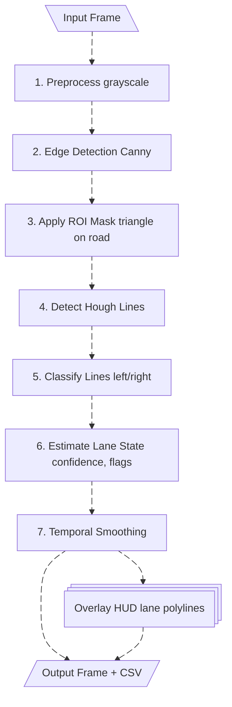

# Lane Keep Assist (LKA) 

**Author:** *Samantha Caballero*  
 ADAS – Lane Keeping Assist Implementation  
**Language:** Python (OpenCV)

A modular, classical-computer-vision-based LKA perception system that detects left and right lane boundaries from video, overlays them on the input frames, and logs full per-frame metrics. The system focuses on **interpretability**, **classical CV techniques**, **temporal smoothing**, and **evaluation-ready outputs**

---

## Table of Contents

[1 – Project Goals](#1--project-goals)  
[2 – Lane Detection Pipeline](#2--lane-detection-pipeline)  
&nbsp;&nbsp;&nbsp;• Pipeline Flowchart  
&nbsp;&nbsp;&nbsp;• Step-by-step description  
[3 – Results](#3--results)  
[4 – Design Choices & Limitations](#4--design-choices--limitations)  
[5 – Build & Run Instructions](#5--build--run-instructions)  
[6 – Project Structure](#6--project-structure)

---

# 1 – Project Goals

The goal of this project is to build a **classical computer vision Lane Keep Assist (LKA) perception module** that:

1. Detects **left** and **right lane boundaries** for every video frame.  
2. Determines if each side is **detected (YES/NO)** based on confidence values.  
3. Produces an **annotated output video** with overlaid detected lane lines and a HUD.  
4. Produces a **per-frame CSV file** containing:  
   - `left_detected`, `right_detected`  
   - `left_conf`, `right_conf`  
   - `lat_offset_m` (approx. ego-lane offset)  
5. Computes **quality metrics** including:  
   - Side detection accuracy  
   - Curve quality (MAE or IoU)  
   - Temporal stability of lateral offset  
   - Latency per frame  

---

# 2 – Lane Detection Pipeline


The system uses a clean, modular pipeline implemented across several Python files.


## **Pipeline Flowchart**


*Fig. 1: Detection Pipeline Flowchart*


---
## Step-by-Step Pipeline Description

### **Step 1 – Preprocess**
- Convert the RGB frame to **grayscale**.  
- Apply Gaussian blur for stability.  
This prepares the frame for edge detection.

### **Step 2 – Edge Detection (Canny)**
- Detect edges using **Canny Edge Detection** (50–150 threshold).  
- Output is a binary map of strong edges.

### **Step 3 – Apply ROI Mask**
- Use a triangular mask covering the **road region**.  
- Remove pixels outside this area.  
This focuses the detector on the driving lane.

### **Step 4 – Detect Hough Lines**
- Apply **HoughLinesP** to detect short line segments representing lane markings.  
- Segments are collected for classification.

### **Step 5 – Classify Lines (Left vs. Right)**
- Compute slopes `m` for each segment.  
- Negative slope → **left lane**; Positive slope → **right lane**.  
- Average segments to obtain one representative line per lane side.

### **Step 6 – Estimate Lane State**
- Compute **confidence** for each side based on segment consistency.  
- Compute `left_flag` and `right_flag` from confidence threshold (0.6).  
- Estimate **lateral offset** by comparing the lane center to the image center.

### **Step 7 – Temporal Smoothing**
- Apply **exponential smoothing** across frames to stabilize:  
  - Line endpoints  
  - Confidences  
  - Lateral offset  
- Reduces flickering and improves continuity.

### **Step 8 – Final Overlay and HUD**
- Draw left lane in **green**, right lane in **blue** if detected.  
- Otherwise draw **gray dashed** fallback lines.  
- Add HUD showing:  
  `Left: YES/NO | Right: YES/NO | Conf: avg_conf`

### **Outputs**
- **Video:** annotated lane detection output (`outputs/*.mp4`).  
- **CSV:** per-frame metrics (`outputs/per_frame*.csv`).  
- **Debug video:** multi-panel visualization (optional via metrics module).

---

# 3 – Results

### Night performance


### Highway day performance


### ✔ Working Features
- Stable lane detection using **Canny + ROI + HoughLinesP**.  
- Smooth temporal behavior under moderate noise.  
- Accurate detection flags (YES/NO) based on confidence.  
- Lateral offset estimation for tracking vehicle within lane.  
- Clear HUD and visual overlays.

### ✔ Debug Mosaic Video
A multi-panel video can be generated using `metrics.py`, showing:  
`[input | preprocess | edges] / [ROI | Hough | classified]`

Useful for analysis and report documentation.

---

# 4 – Design Choices & Limitations

### **Design Choices**
- **Classical CV approach** for maximum interpretability.  
- **Canny + ROI** to robustly isolate lane edges.  
- **HoughLinesP** for straightforward lane segment detection.  
- **Temporal smoothing** to minimize jitter.

### **Limitations**
- ROI mask is fixed, not adaptive to curves.  
- HoughLinesP struggles with:  
  - rain, shadows, worn paint, heavy noise.  
- Only straight-line modeling 
---

# 5 – Build & Run Instructions

### **Requirements**
```bash
pip install opencv-python numpy pandas
```

### **Run the Lane Detection Pipeline**
```bash
python src/main.py
```

This will:  
- Load `data/night.mp4`  
- Process every frame  
- Generate:  
  - `outputs/night4.mp4`  
  - `outputs/per_frame_night4.csv`

### **Run Metrics**
Example:
```python
from metrics import compute_detection_accuracy, temporal_stability
```

### **Generate Debug Mosaic Video**
```python
from metrics import write_pipeline_debug_video
```

---

# 6 – Project Structure

```
LKA_project/
├── data/                 # Input videos
├── outputs/              # Output videos + CSV
│   ├── night4.mp4
│   └── per_frame_night4.csv
├── src/
│   ├── main.py           # Main processing loop
│   ├── preprocess.py     # Canny + ROI mask
│   ├── warp.py           # Identity warp / placeholder
│   ├── lane_fit.py       # Hough line detection + classification
│   ├── temporal.py       # Exponential smoothing
│   ├── overlay.py        # Drawing + HUD
│   └── metrics.py        # Metrics + debug video
└── README.md             # This file
```

---


